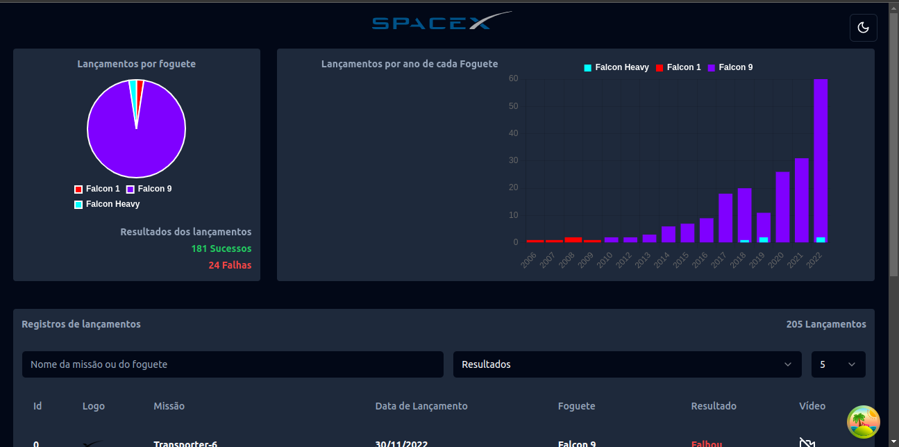
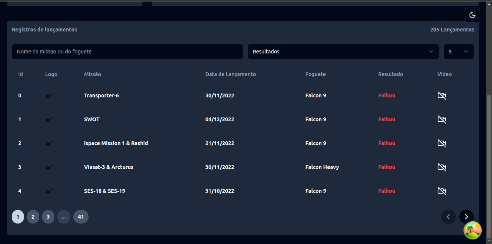
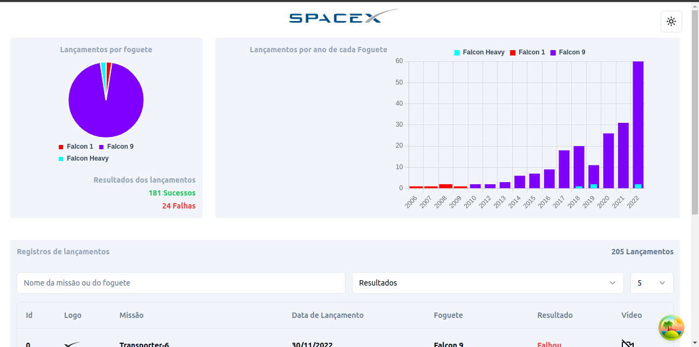
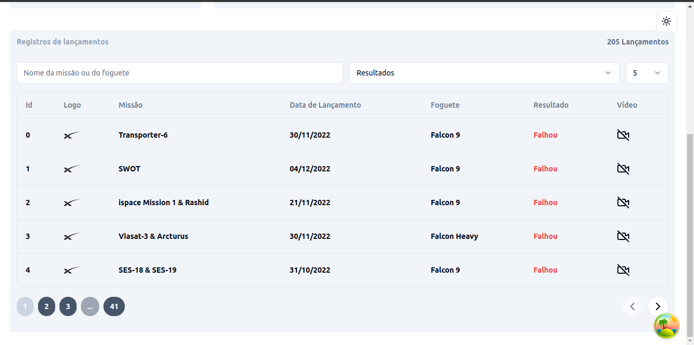
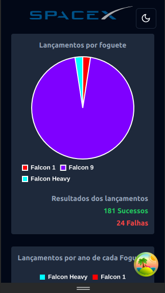
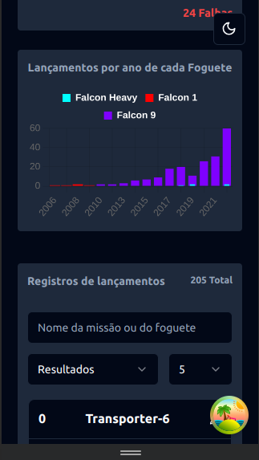
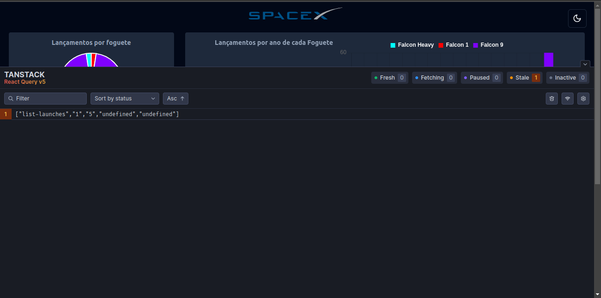

# Fullstack Challenge 🏅 Space X API

## Frontend teste

### STACK

NextJs with Tailwind and typescript.

### Descrição

This project are powered by API REST developed to <a href="https://github.com/Rharuow/Teste-coodesh-backend" target="_blank">Backend Fullstack Test</a>. The data are feed by <a href="https://github.com/r-spacex/SpaceX-API">SpaceX public API</a>.

#### Install and Start

```bash
git clone git@github.com:Rharuow/Teste-coodesh-frontend.git && cd ./Teste-coodesh-frontend && npm i && npm run dev
```

#### What have in this project?

- [x] Server Components (SSC)

- Using NextJs 13, by default, the components are SSR and it allows us do fetchs data before the component send to client. In SSC, it's impossible use hooks, like useState, useEffect or anyone. Furthermore, the browser properties, as navigate, document, window etc, are unavailable. On the other hand, the nodejs server properties are available, and the component can be async to await the promise resolve.

- [x] Client Components

- Using NextJs 13, put 'use client' at top of file component, the components are sent to client, behaving like a tipical React Component.

- [x] Pure Component

- Components isolated and utils directories keep functions with a single responsibility.

- [x] Isolated Modules

- Components Modules and Functions Modules exported are available to be used, but can't be possible make modification.

- [x] Responsivity

- In the sm, md and lg breakpoints, the application assume different layouts to respect different screen sizes. To be better the User Interface.

- [x] Reactive filter

- Without button to submit form, the fields are watched and change de data values while they are changed. To be better the User Experience.

#### Tanstack React Query

<p>To prevent many request on filter fields, the React Query are used to stale while revalidate (SWR). If the same search are called, the cache response are returned, until, in the component life cicly, need the revalidation.</p>

#### Plus

- This project have light and dark themes. Provides by context insert on layout file.

- If running localhost, there's a button absolute, bottom and left, that's show how many request are saved by Tanstack React Query.

#### Some prints

1. Charts on desktop screen (Dark theme)
   

1. Launches list table on desktop screen (Dark theme)
   

1. Charts on desktop screen (Light theme)
   
1. Launches list table on desktop screen (Light theme)
   

1. Pie Chart on mobile screen (Dark theme)
   

1. Bar Chart on mobile screen (Dark theme)
   

1. Tanstack React Query develop tools
   
